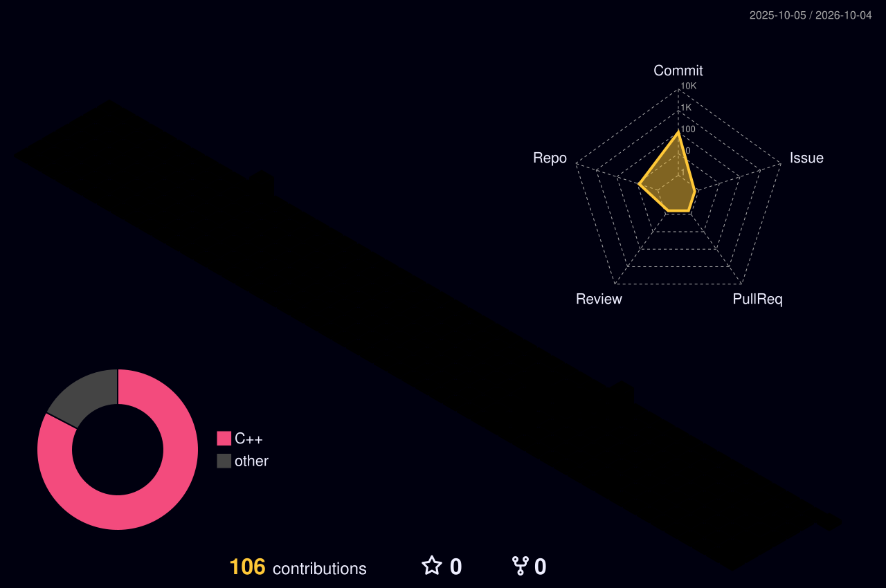

  

  
  

 

---

## 👨‍💻 About Me

- 🎓 3rd Year B.Tech CSE student passionate about Full Stack Web Development and Problem Solving.
- 🌱 Currently learning Data Structures & Algorithms and MERN Stack Development (completed Frontend: HTML, CSS & JavaScript, now exploring the backend).
- 🚀 I enjoy building responsive web applications and continuously improving my development skills.
- 🏔️ Fun fact: When I’m not chasing bugs in VS Code, I’m usually chasing mountain views.

---

## 🛠️ Tech Stack

**Languages**

  
  

**Frontend**

  
  
  
  

**Backend (Currently Learning)**

  
  
  

**Database**

  

**Tools & Platforms**

  
  
  

---

## 🚀 Featured Projects

**Responsive Portfolio Website** — A personal portfolio built using HTML, CSS, and JavaScript with a modern responsive design.

**JavaScript Mini Projects Collection** — A collection of interactive frontend projects built to strengthen JavaScript fundamentals.

---

## 📊 GitHub Stats

<table align="center">
  <tr>
    <td>
      
    </td>
    <td>
      
    </td>
  </tr>
</table>

  

---

### 📈 GitHub Activity

  

